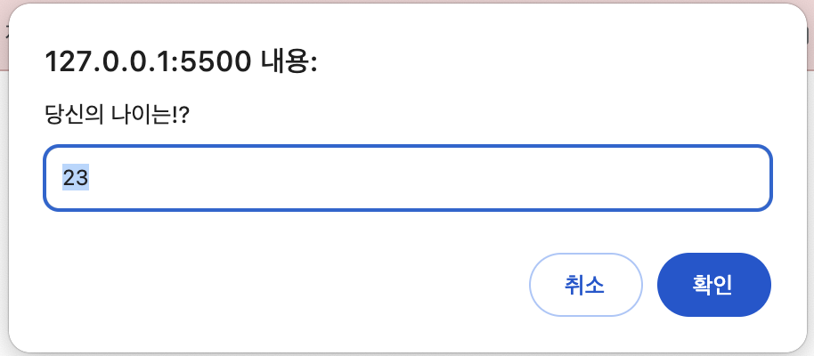
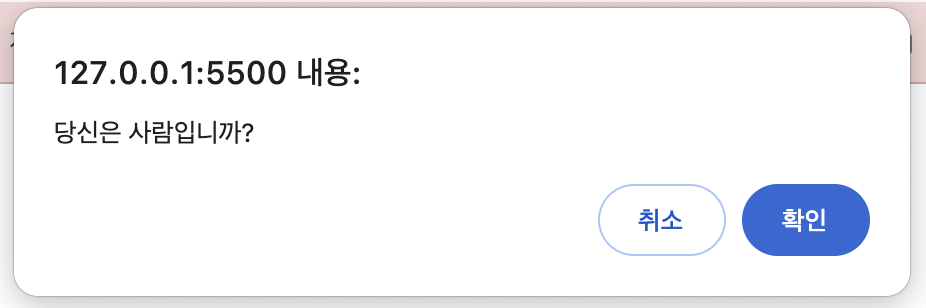

# JavaScript Basic

## 변수

### 키워드

- **`let`**: 재선언 불가능, 재할당 가능
- **`const`**: 재선언, 재할당 불가능 ➡️ 한 번 값을 할당하면 더는 값을 바꿀 수 없는 상수를 정의할 때 주로 사용
- **`var`**: 재선언, 재할당 가능 ➡️ 과거에 쓰이던 키워드

### 변수 명명 규칙

1. 숫자/문자 사용 ➡️ 단, **첫 글자는 숫자가 될 수 없음.**

- 예) `let 1st` (X), `let num1` (O)

2. 특수기호는 **`_`**, **`$`** 만 사용 가능

---

## 자료형

### 종류

1. **Number** (숫자형)
2. **BigInt** (빅인트형, 아주 큰 숫자를 저장할 수 있음)
3. **String** (문자형)
4. **Boolean** (불린형, 논리값 `true`, `false`)
5. **null** (널, 비어있음, 존재하지 않음)
6. **undefined** (언디파인드, 값이 할당되지 않은 상태)
7. **object** (객체형)
8. **Symbol** (심볼형, 고유한 식별자를 만들 때 사용)

### typeof

- 값의 **자료형을 반환**해줌

  ```javascript
  typeof 1; // number
  typeof "안녕하세요"; // string

  // 예외
  typeof null; // object ➡️ 언어 자체의 오류
  typeof function () {}; // function
  ```

---

## 상호작용

호스트 환경이 브라우저인 경우, 내장 함수를 이용해 사용자와 상호작용할 수 있다. <br />
세 함수는 모두 모달 창을 띄워주는데, 사용자는 모달 창 외에 페이지에 있는 그 무엇과도 상호작용 할 수 없다.

1. **`prompt(question, [default])`**

- 프롬프트 창에 매개변수로 받은 `question` 을 넣어 사용자에게 보여준다.
- "확인" 버튼을 눌렀을 땐, **사용자가 입력한 값을 문자열 형태로 반환**하고
  - 아무것도 입력하지 않으면 빈 문자열(`""`) 반환
- "취소" 버튼을 눌렀을 땐, **`null` 을 반환**한다.
  ```javascript
  prompt("당신의 나이는?!", 23);
  ```
  

2. **`confirm(question)`**

- 컨펌 대화상자에 매개변수로 받은 question 을 넣어 사용자에게 보여준다.
- 사용자가 "확인" 버튼을 누르면 `true` 를 반환하고
- 그 외의 경우는 `false` 를 반환한다.
  ```javascript
  confirm("당신은 사람입니까?");
  ```
  

3. **`alert(message)`**

- 메시지가 담긴 얼럿 창을 보여준다.

---

## 연산자

### 산술 연산자

- 사칙 연산과 관련된 연산자
  - `+ - * /`
- 나머지 연산자 ➡️ `%`
- 거듭제곱 연산자 ➡️ `**`

### 할당 연산자

- `a = b` 형태의 할당 연산자
- `a += b` 형태의 복합 할당 연산자

### 조건부 연산자

- 자바스크립트 연산자 중 유일하게 매개변수가 3개인 연산자
- **`condition ? resultA : resultB`**
  - `condition` 이 truthy 면 `resultA` 를,
  - `condition` 이 falsy 면 `resultB` 를 반환한다.

### 논리 연산자

- **AND (&&)**: 둘 다 참이여야 참, 첫 번째 falsy 를 찾음.
- **OR (||)**: 하나라도 참이면 참, 첫 번째 truthy 를 찾음
- **NOT (!)**: 피연산자의 자료형을 불린형으로 바꾼 후, 그 역으로 반환

### nullish 연산자

- **`a ?? b`**
  - a 가 `null` 이나 `undefined` 면 b 를 반환하고, 아니면 a 를 반환한다.

### 비교 연산자

- **동등 연산자 `==`**: 형이 다른 값끼리 비교할 때, 피연산자의 자료형을 숫자형으로 바꾼 후 비교를 진행한다. `null` 과 `undefined` 는 둘 끼리 비교할 땐 참을 반환하지만, 다른 자료형과 비교할 땐 거짓을 반환한다.
  - 이때, `null` 과 `undefined` 를 일치 연산자 `===` 로 비교하면 거짓이 나온다.
- 기타 비교 연산자들 `<`, `>`, `>=`, `<=` 역시 피연산자의 자료형을 숫자형으로 바꾼 후, 비교를 진행한다.
- **일치 연산자 `===`**: 피연산자의 형을 변환하지 않는다. 형이 다르면 무조건 다르다고 평가한다.

---

## 반복문

```javascript
// 1
while (condition) {
  ...
}

// 2
do {
  ...
} while (condition);

// 3
for(let i = 0; i < 10; i++) {
  ...
}
```

- `for(let ...)` 안쪽에 선언한 변수는 오직 반복문 내에서만 사용 가능하다.
  - `let` 을 생략하고 기존에 선언되어있는 변수를 사용하는 것도 가능하다.
- 지시자 `break`, `continue` 는 반복문 전체나 현재 실행 중인 반복을 빠져나가는 데 사용된다.
  - 레이블은 중첩 반복문을 빠져나갈 때 사용한다.

---

## switch 문

- switch 문은 조건을 확인할 때 내부적으로 일치 연산자를 사용해 비교를 진행한다.

  ```javascript
  let age = prompt("나이를 알려주세요.", 18);

  switch (age) {
    case 18:
      alert("Won't work"); // prompt 함수는 항상 문자열을 반환하므로, 이 case문엔 절대 도달할 수 없습니다.
      break;

    case "18":
      alert("낭랑 18세이시군요!");
      break;

    default:
      alert("어떤 case문에도 해당하지 않습니다.");
  }
  ```

---

## 함수

### 함수 선언 방법

1. **함수 선언문**

```javascript
function sum(a, b) {
  let result = a + b;

  return result;
}
```

- 함수 선언하기 전에 접근 가능

2. **함수 표현식**

```javascript
let sum = function (a, b) {
  let result = a + b;

  return result;
};
```

- 함수 코드를 만나야 생성되기 때문에, 함수 선언 전에 접근 불가능

3. **화살표 함수**

```javascript
// 화살표(=>) 우측엔 표현식이 있음
let sum = (a, b) => a + b;

// 중괄호{ ... }를 사용하면 본문에 여러 줄의 코드를 작성할 수 있음. return문이 꼭 있어야 함.
let sum = (a, b) => {
  // ...
  return a + b;
};

// 인수가 없는 경우
let sayHi = () => alert("Hello");

// 인수가 하나인 경우
let double = (n) => n * 2;
```

- 함수 표현식과 마찬가지로, 함수 선언 전에 접근 불가능

- 함수는 지역 변수를 가질 수 있다.
  - **지역 변수**는 함수 본문에 선언된 변수로, **함수 내부에서만 접근**할 수 있다.
  - 반대로, 함수 밖에서 선언된 변수는 전역 변수 (외부 변수)
  - 전역에서 지역 변수로 접근은 불가능하다.
- 매개변수에 기본값 설정 가능
  - `function sum(a = 1, b = 2) {...}`
- **`return`** 키워드를 사용해서 **무언가를 반환**할 수 있다.
